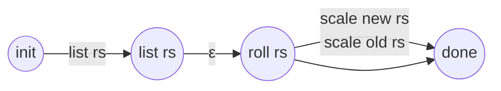
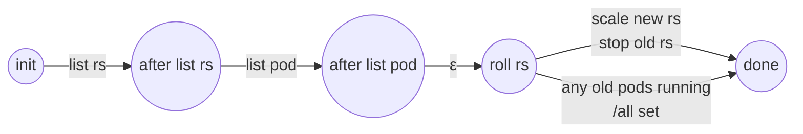

# Deployment Controller (DC)

## Reconciliation Login

> In `pkg/controller/deployment/deployment_controller.go`

Reconciliation is performed by `syncDeployment`, which can be modeled as state machine:

0. Orphaning, adoption. This one is not considered in the model

1. [List all replicasets](https://github.com/kubernetes/kubernetes/blob/cdc807a9e849b651fb48c962cc18e25d39ec5edf/pkg/controller/deployment/deployment_controller.go#L629) (RS) owned by this DC from API Server

2. [Get all pods](https://github.com/kubernetes/kubernetes/blob/cdc807a9e849b651fb48c962cc18e25d39ec5edf/pkg/controller/deployment/deployment_controller.go#L638) managed by controlled RS and create a RS-pod map from API Server

3. Make decision on how to manage controlled RS:
   x. Rollback, not considered in the model
   Compare managed RS template and DC template,
   **A**. if the number of replica is different, this is a [scaling event](https://github.com/kubernetes/kubernetes/blob/cdc807a9e849b651fb48c962cc18e25d39ec5edf/pkg/controller/deployment/deployment_controller.go#L665), just scale up/down the single newest controlled RS
   **B**. The application managed* by DC should be updated (`spec.template.container`). Based on the configured update policy**:

   ​	I. [rollout](https://github.com/kubernetes/kubernetes/blob/cdc807a9e849b651fb48c962cc18e25d39ec5edf/pkg/controller/deployment/rolling.go#L31): (Create if non-existing and) scale up new RS, then scale down old RS
   ​	II. [recreate](https://github.com/kubernetes/kubernetes/blob/cdc807a9e849b651fb48c962cc18e25d39ec5edf/pkg/controller/deployment/recreate.go#L29): Scale down old RS, then (create if non-existing and) scale up the new RS.

---

*: The deployment controller will only control at most one new replica set, and multiple old replica sets

> In k8s implementation it's [possible](https://github.com/kubernetes/kubernetes/blob/cdc807a9e849b651fb48c962cc18e25d39ec5edf/pkg/controller/deployment/util/deployment_util.go#L633-L634) to have multiple new replica sets in rare cases

**: The scale up/down process should satisfy `maxSurge` and `maxUnavailable` properties of DC, which means DC may not scale the controlled new & old RS to desired replicas in one step. Instead DC will scale up & down gradually in turn. Currently we do not model this feature.

## Reconciliation State Machine

**Rolling Update**

**Rollout Update**

> we need to figure out how to add a "barrier" of waiting till all old pods stop running, then add new rs

